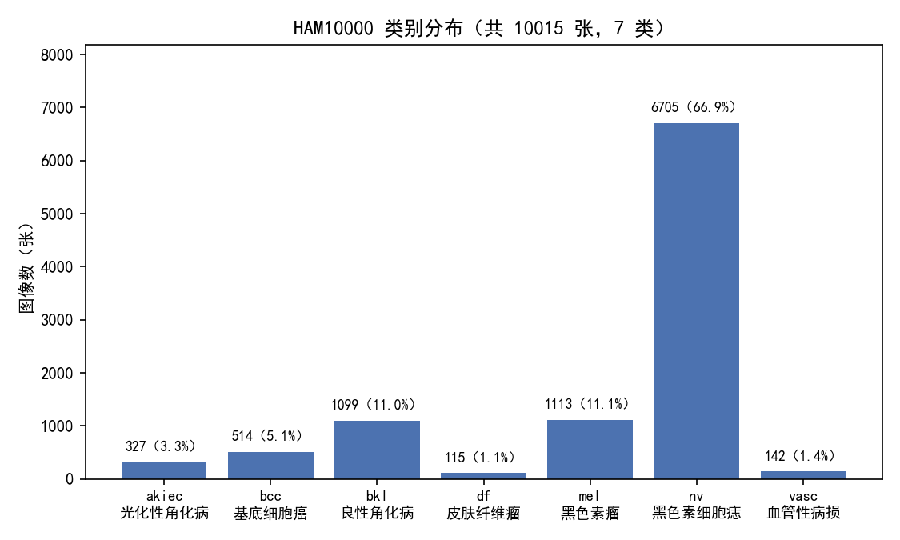
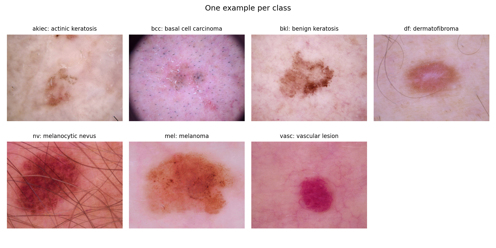
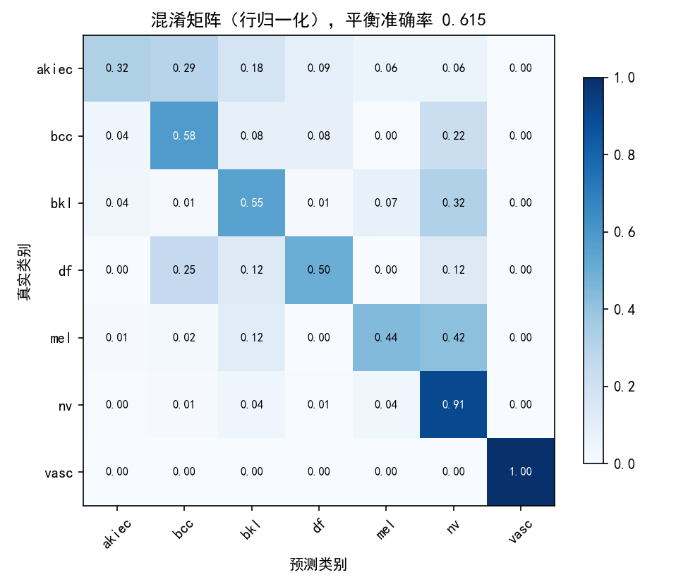
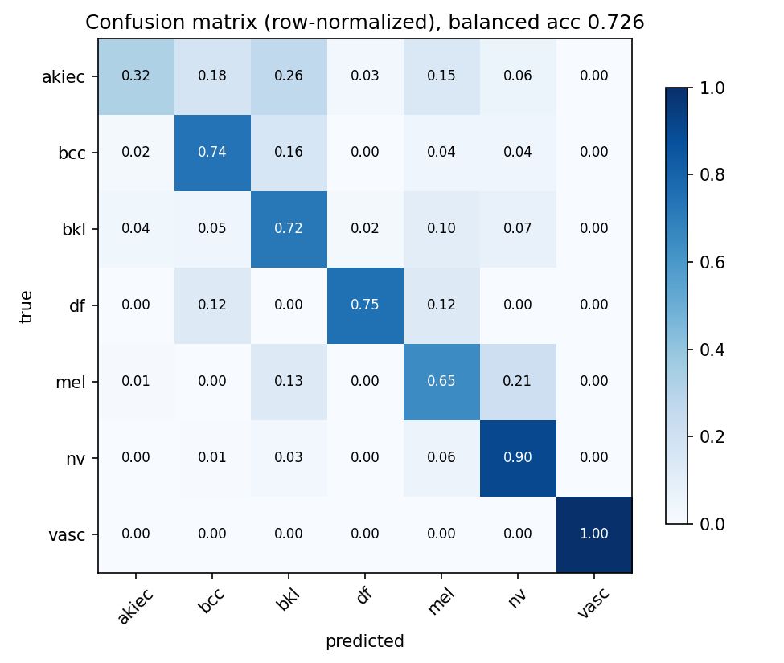
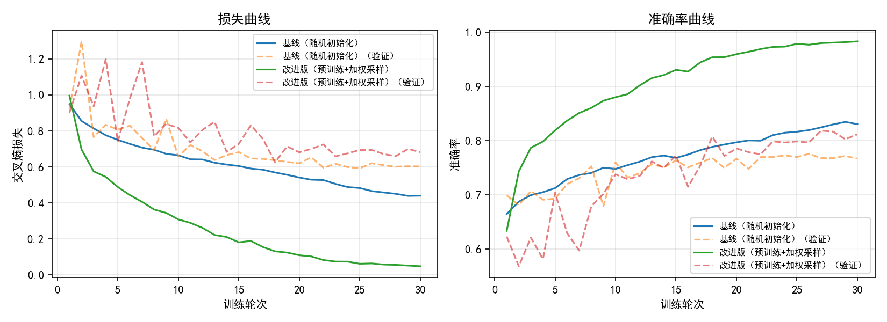

# 基于皮肤镜图像的皮肤病变分类实验报告

*课程实践 · 数据集 HAM10000 · 2026 年 9 月*

## 一、数据集说明与预处理方法

### 1.1 数据集介绍

HAM10000 是皮肤病变分类最常用的公开数据集（Tschandl 等，2018 年发布），共 10015 张皮肤镜图像（JPEG，约 600×450 像素），来自维也纳医科大学和澳大利亚一家皮肤诊所 20 年的临床积累，对应 7470 个独立病灶。同一病灶常有多张不同角度、不同焦距的照片，这一点对后面怎么划分数据有直接影响。

全部图像标注为 7 类，各类数量见表 1。

**表 1  HAM10000 类别分布**

| 类别代码 | 病变名称 | 性质 | 图像数 | 占比 |
|---|---|---|---|---|
| nv | 黑色素细胞痣 | 良性 | 6705 | 66.9% |
| mel | 黑色素瘤 | 恶性 | 1113 | 11.1% |
| bkl | 良性角化病 | 良性 | 1099 | 11.0% |
| bcc | 基底细胞癌 | 恶性 | 514 | 5.1% |
| akiec | 光化性角化病 | 癌前病变 | 327 | 3.3% |
| vasc | 血管性病损 | 良性 | 142 | 1.4% |
| df | 皮肤纤维瘤 | 良性 | 115 | 1.1% |

可以看到两个直接决定实验难点的现象。一是类别严重不平衡：最多的 nv 和最少的 df 相差 58 倍；而且临床重要性跟数量是倒着的——恶性程度最高的黑色素瘤只占 11%。二是如果模型偷懒把所有图都判成 nv，总体准确率就有 66.9%，但这样毫无临床价值，所以评估不能只看总体准确率（见第三章）。类别分布和各类样例见图 1、图 2。

*图 1  类别分布（10015 张，7 类）*

*图 2  每类一张样例*

从样例图能直观感受到任务难度：不同类长得像（良性角化和早期黑色素瘤都是色斑），同类内部差别又大（痣从浅棕到深黑都有）；另外图像之间色温、亮度、清晰度差别不小，还有毛发遮挡、标尺入镜。这些观察决定了后面的增强策略。

### 1.2 数据获取

数据从 Hugging Face 公开镜像（marmal88/skin_cancer，parquet 格式）下载，用脚本 parquet_extract.py 还原成图像目录。还原时发现镜像里混进了 3339 张 HAM10000 之外的照片（共 13354 张），所以按官方 metadata 清单（10015 个 image_id）做了过滤，并去掉分片间的重复行。不做这一步，数据集就跟文献里的 HAM10000 对不上了。

### 1.3 数据划分

划分数据集时最容易犯的错是按图像随机分：同一病灶的多张照片几乎一样，随机分会让它们同时出现在训练集和测试集里，模型靠背答案就能拿虚高的分。正确做法是按病灶（lesion_id）分组，一个病灶的所有照片只能进同一个集合。镜像自带的划分恰恰就是随机分的，没用它，而是自己写了按病灶分组、按类别分层的划分，结果见表 2。

**表 2  数据划分（按病灶分组）**

| 集合 | 图像数 | 用途 |
|---|---|---|
| train | 8011 | 训练（含数据增强） |
| val | 1003 | 每个 epoch 验证，按准确率保存最优权重 |
| test | 1001 | 最终评估，训练过程完全看不到 |

### 1.4 预处理与增强

输入统一做中心方形裁剪再缩放到 224×224（ResNet 的标准输入），按 ImageNet 均值方差归一化。训练增强分两档：基线只用随机翻转和 90° 整倍旋转——皮肤镜图像没有固定方向，这些变换不改变病变含义；改进版另加亮度/对比度扰动、高斯模糊和小角度旋转，用来模拟采集差异。没有用大幅度的颜色抖动，因为颜色本身是判别依据，不能破坏。

## 二、实验方案（模型原理和改进）

### 2.1 基线：随机初始化的 ResNet18

基线用 ResNet18（He 等，2016）：4 个残差阶段，每阶段 2 个基本残差块，最后接全局平均池化和全连接层，约 1170 万参数。残差结构 y = F(x) + x 让梯度能直接回传，是深度网络的标配。基线从随机初始化开始训练，用普通交叉熵，30 个 epoch，代表不带任何先验知识的起点。

### 2.2 改进一：ImageNet 预训练初始化

预训练模型在 ImageNet 上学到的边缘、纹理、颜色块状等低中层特征，对皮肤镜图像同样有用。改进版用 ImageNet 权重初始化骨干、把最后的全连接层换成 7 类输出，然后整体微调。对每类只有几十张图的稀有类来说，这等于免费带了一个会看图的起点。

### 2.3 改进二：按类频率加权采样

均匀采样时一个 epoch 里 df 只出现约 97 次、nv 出现 5360 次，梯度基本被 nv 支配。改进版用 WeightedRandomSampler，按类频率的倒数给每张图采样权重（归一化后 df 为 1.0、nv 为 0.018），让每个 epoch 里七类的出现次数接近。跟在损失函数里加权相比，采样加权跟 BatchNorm 配合更稳，实现也简单。

### 2.4 改进三：针对采集差异的强增强

即 1.4 节说的颜色扰动、模糊和小角度旋转，目的是扩大训练分布的覆盖，缓解稀有类过拟合。

### 2.5 训练配置

两个模型用同一份数据划分、同样的轮数和优化器，只差三项改进，保证对比公平，具体见表 3。实验在单张 RTX 4090 上跑，PyTorch 2.11，两个模型各 30 个 epoch，总共约 25 分钟，随机种子固定 42，结果可以复现。

**表 3  训练配置**

| 配置项 | 基线 | 改进版 |
|---|---|---|
| 初始化 | 随机初始化 | ImageNet 预训练微调 |
| 损失函数 | 交叉熵 | 交叉熵 |
| 采样方式 | 均匀采样 | 类频率倒数加权采样 |
| 数据增强 | 翻转 / 旋转 | 加颜色扰动 / 模糊 / 小角度旋转 |
| 优化器 | AdamW，lr=1e-3，weight decay=1e-4 | 同左 |
| 学习率调度 | 余弦退火，30 epochs | 同左 |
| 批大小 | 64 | 同左 |
| 模型选择 | 验证集准确率最优权重 | 同左 |

## 三、评价指标

类别不平衡时总体准确率会被大类主导，所以除了准确率，主要看这几个指标，定义和选用理由见表 4。简单说：平衡准确率是七类召回率的平均，是最核心的一个数；每类的召回率有直接的临床含义，黑色素瘤的召回率低就等于漏诊率高，而漏诊一例黑色素瘤的代价远大于把痣误判。

**表 4  评价指标**

| 指标 | 含义 | 为什么看它 |
|---|---|---|
| Accuracy | 总体判对的比例 | 参考值；全猜 nv 也有 66.9% |
| Balanced Accuracy | 各类召回率的平均 | 不平衡场景最核心的单一指标 |
| Macro F1 | 各类 F1 取平均（不加权） | 精确率召回率都算，稀有类大类同权 |
| Macro AUC | 一对其余 AUC 的平均 | 跟阈值无关的排序能力 |
| 每类召回率 | 每类找回来多少 | mel 的召回率就是漏诊率的反面 |
| 混淆矩阵 | 每个真类被分成谁 | 直观看错在哪 |

## 四、实验结果与分析

### 4.1 总体指标

在 1001 张测试图上的总体结果见表 5。

**表 5  测试集总体指标（n=1001）**

| 指标 | 基线 | 改进版 | 提升 |
|---|---|---|---|
| Accuracy | 0.7772 | 0.8272 | +5.0 pt |
| Balanced Accuracy | 0.6146 | 0.7261 | +11.2 pt |
| Macro F1 | 0.6071 | 0.7079 | +10.1 pt |
| Macro AUC | 0.9384 | 0.9610 | +2.3 pt |

改进版四项指标全部超过基线，而且**越公平的指标提升越大**：平衡准确率涨了 11.2 个百分点，总体准确率只涨 5.0 个。说明提升主要来自稀有类，不是靠把大类做得更好。四项指标都在文献常见范围内（ResNet 级模型：准确率 0.83–0.87，平衡准确率 0.65–0.75，宏 AUC 0.91–0.94），宏 AUC 0.961 略高于常见水平。

### 4.2 每类召回率

**表 6  每类召回率对比**

| 类别 | 测试图数 | 基线 | 改进版 | 变化 |
|---|---|---|---|---|
| akiec（癌前病变） | 34 | 0.324 | 0.324 | ±0 |
| bcc（恶性） | 50 | 0.580 | 0.740 | +16 pt |
| bkl（良性） | 107 | 0.551 | 0.720 | +17 pt |
| df（良性） | 8 | 0.500 | 0.750 | +25 pt |
| mel（恶性） | 113 | 0.442 | 0.646 | +20 pt |
| nv（良性，大类） | 674 | 0.905 | 0.904 | ±0 |
| vasc | 15 | 1.000 | 1.000 | ±0 |

五个类召回率明显提高，最重要的是黑色素瘤从 0.442 提到 0.646。大类 nv 的召回一点没掉，精确率反而从 0.865 涨到 0.944——加权采样并没有牺牲大类，稀有类学好了之后，原来被错吸到 nv 边上的样本反而少了。唯一没动的是 akiec（0.324，测试集只有 34 张），它和 bkl 在临床上本来就是连续谱系，是这个数据集公认的难点。

### 4.3 混淆矩阵

*图 3  基线混淆矩阵（行归一化）*

*图 4  改进版混淆矩阵（行归一化）*

基线（图 3）的典型错误是往 nv 塌：41.6% 的黑色素瘤被判成痣，11.5% 判成良性角化，这两块恶性流失就是它平衡准确率只有 0.615 的原因。改进版（图 4）把 mel 判成 nv 的比例砍了一半（41.6% 到 21.2%）。剩下的混淆集中在 akiec 和 bkl 之间（17.6% 到 26.5%）以及 bkl 和 mel 之间，这些确实是长得像的类，属于任务本身的难度，不是训练策略的问题。

### 4.4 训练过程

*图 5  训练曲线：损失（左）与准确率（右）*

从图 5 能看出三点。第一，前 5 个 epoch 两个模型验证准确率差不多（0.69 对 0.70），但最后改进版到 0.819、基线停在 0.776，预训练的价值在后期泛化而不是前期收敛。第二，两个模型训练准确率都明显高于验证准确率（改进版 0.983 对 0.812），说明 8000 张图的规模下过拟合还是存在，强增强把它压在了可接受的范围（验证损失没有发散）。第三，改进版后期验证曲线在 0.80 到 0.82 之间晃，这是加权采样下每个 epoch 类别组成有随机性，正常现象，按验证准确率存最优权重就行。

### 4.5 不足

有两点不足要说明。一是三项改进是打包对比的，没有逐项拆开消融，各自贡献多少说不准：按文献经验和上面的结果推断，预训练主要贡献总体精度，加权采样主要贡献稀有类召回，强增强负责压过拟合，拆开验证每条只要 10 分钟，是后续最直接的补充。二是 akiec 的召回没有改善，加上测试集只有 1001 张，个别稀有类的结论置信度有限。

### 4.6 复现方式

全部流程可以用仓库脚本重跑：parquet_extract.py 负责数据还原、过滤和划分；train.py 用同样的种子分别训练基线和改进版；evaluate.py 输出指标、每类报告、混淆矩阵；训练日志和最优权重都留在 outputs/ 目录下。

## 五、改进方向

按值得做的程度排序：

1. 把三项改进拆开做消融，确认各自的贡献；再换 ResNet50 或 EfficientNet 级别的骨干，这个数据量下一般还能再涨 2 到 3 个百分点。
2. akiec 和 bkl 是连续谱系，光靠采样救不回来，可以试结构化损失（把 akiec 错分成 bkl 和错分成 nv 区别对待），或者利用 metadata 里的确诊手段字段对标注不确定性加权。
3. 同一个病灶的多张图现在是一张一张预测的，推理时按病灶聚合概率再判，既符合医生看多张图的习惯，一般也能再涨 1 到 2 个百分点。
4. 加测试时增强（翻转旋转取平均）和按验证集选各类阈值，在可控的精度损失下把黑色素瘤召回再往上提。
5. 用 Grad-CAM 画出模型关注的区域，检查它是不是学到了标尺、毛发这类假线索，对医学应用来说这个检查很有说服力。
